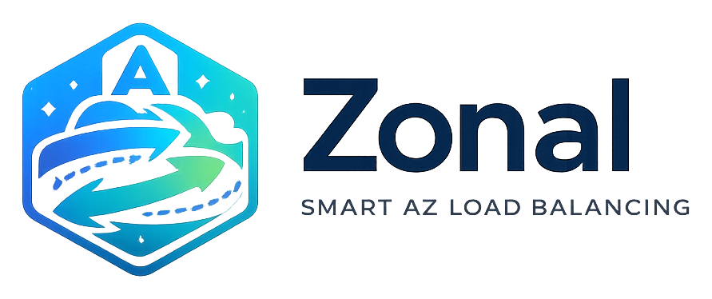

<p align="center">
  
</p>

<p align="center">
  <strong>AZ-affine client-side load balancing over AWS Cloud Map.</strong><br>
  Keep your service-to-service (east-west) traffic <em>in the same Availability Zone</em> — cut the cross-AZ data-transfer bill without an ALB/NLB in the path.
</p>

<p align="center">
  <a href="#"></a>
  <a href="#-local-development"></a>
  <a href="#-license"></a>
  <a href="https://fmiquel90.github.io/zonal/"></a>
  <a href="#"></a>
</p>

<p align="center">
  📖 <strong><a href="https://fmiquel90.github.io/zonal/">Read the documentation →</a></strong>
</p>

---

## 💸 The problem

EC2 callers hit other EC2 hosts directly. With no load balancer enforcing locality, a caller in
`az-A` happily talks to a host in `az-B` — and every gigabyte that crosses the AZ boundary is billed
`$0.01/GB` **in each direction**, so `$0.02` per GB actually moved. At 100 TB/month of east-west
traffic that's **~$2,000/month** of pure transfer cost; at hundreds of TB, several times that.

Traffic that stays inside one AZ over private IPv4 is **free**. That gap is the whole opportunity.

The usual fix — an internal NLB with cross-zone load balancing disabled — is neither free nor
automatic. Each NLB node only forwards to targets in *its* AZ, but DNS still hands the client one
node IP **per** AZ, so a caller can land on a remote node unless you also enable AZ DNS affinity or
resolve the zonal hostname yourself. And every gigabyte then pays an LCU processing fee
(~`$0.006/GB` where processed bytes is the dominant LCU dimension) plus an hourly charge per AZ.
That is *cheaper* than the cross-AZ transfer it replaces — but it's a per-GB tax on 100% of your
traffic, plus an extra hop.

**`zonal` keeps the traffic peer-to-peer and intra-AZ — which is free** — by making each caller pick a
healthy host *in its own AZ*, falling back to other AZs only when it must. No hop, no per-GB fee.

> 💲 Figures are list price, `us-east-1`/`eu-west-1`, checked August 2026. Verify for your region on
> the [EC2 data transfer](https://aws.amazon.com/ec2/pricing/on-demand/) and
> [ELB](https://aws.amazon.com/elasticloadbalancing/pricing/) pricing pages.

## ✨ Features

- 🎯 **One job: give me a healthy host in my AZ** — `balancer.pick()` returns a same-AZ host,
  falling back to other AZs only when none are healthy. zonal selects; **you own the transport**
  (your HTTP client, your auth, your streaming, your retries).
- 🧭 **AZ affinity + fallback, client-side authoritative** — the balancer keeps same-AZ hosts when
  any are healthy, else falls back to all healthy hosts (and emits a `cross_az_fallback` log). The
  AZ-ID *is* still sent as `DiscoverInstances` `OptionalParameters` to narrow the payload
  server-side — but affinity never depends on it. AWS documents those as **opportunistic** filters
  that fail open: when no instance matches, the filter is silently dropped and every instance comes
  back. Emulators may ignore them outright. Re-applying affinity locally makes the behaviour
  identical everywhere, and testable.
- 🆔 **AZ-ID, not AZ-name** — AZ names are randomized per account; the AZ-ID (`euw1-az1`) is stable
  and physically consistent. Routing keys on the ID.
- 🩺 **Two-layer health** — Cloud Map holds the shared, slow-moving status (pushed by the health
  service); the balancer adds a **fast local circuit breaker** you feed with `report_failure` /
  `report_success` — *you* decide what counts as a failure (timeout, 5xx, bad body…).
- ⚡ **Cache-only hot path** — a background loop refreshes hosts every few seconds; `pick()` never
  calls AWS inline. Stale-but-working always beats an empty cache.
- 🔄 **Sync & async** — `Balancer` and `AsyncBalancer` over a shared core.
- 🧱 **Batteries included** — host self-registration + an out-of-band health-check daemon.
- 🪵 **Structured JSON logs** — `structlog`, opt-in, never hijacks the host app's logging.
- 🧪 **Locally testable** — pure unit tests + integration tests against [MiniStack](https://ministack.org).

## 🗺️ Architecture

```
  caller (in az-A)                                         target hosts
 ┌─────────────────────────────────────┐
 │ zonal.Balancer                      │
 │                                     │        ┌─────────────┐
 │ RefreshLoop ~5s ─ DiscoverInstances │  pick()  │ host (az-A) │   preferred · intra-AZ · free
 │   (AZID = az-A)                     │ ───────▶ └─────────────┘
 │                                     │          ┌─────────────┐
 │ HostCache · round-robin · breaker   │ fallback │ host (az-B) │   only if no healthy az-A host
 └─────────────────────────────────────┘ ╌╌╌╌╌╌▶ └─────────────┘   (cross-AZ · billed)
        ▲ HEALTHY hosts          ▲ report_failure / report_success (your transport)
        │                        │
 ┌──────────────────────────────┐      ┌──────────────────────────────┐
 │ AWS Cloud Map (registry)     │◀──── │ zonal-healthcheck (daemon)   │
 │ HEALTHY / UNHEALTHY status   │ push │ probes /health · hysteresis  │
 └──────────────────────────────┘      └──────────────────────────────┘
```

## 🚀 Quick start

```bash
# sync balancer only
pip install "zonal @ git+https://github.com/fmiquel90/zonal.git@main"

# with the async balancer (aioboto3)
pip install "zonal[aio] @ git+https://github.com/fmiquel90/zonal.git@main"
```

### 📞 Caller (sync)

zonal hands you a host; **you make the call** with whatever HTTP client you already use. The `lease()`
context manager picks a host and feeds the circuit breaker automatically — an exception inside the
block ejects that host and re-raises:

```python
import requests
from zonal import Balancer, DiscoveryConfig, configure_json_logging

configure_json_logging()  # optional: JSON logs on stdout
session = requests.Session()

cfg = DiscoveryConfig(namespace="services.internal", service="backend", region="eu-west-1")
with Balancer(cfg) as balancer:
    balancer.wait_ready(timeout=5)

    with balancer.lease() as host:                 # same-AZ host, fallback if none healthy
        resp = session.post(host.url("/work"), data=payload, timeout=(3, 60))
        resp.raise_for_status()                    # raise here -> host ejected from the breaker
```

Prefer explicit control over what counts as a failure? Use `pick()` + `report_*`:

```python
host = balancer.pick()
try:
    resp = session.post(host.url("/work"), data=payload)
    if resp.status_code >= 500:
        balancer.report_failure(host)              # 5xx ejection, at your discretion
except (requests.Timeout, requests.ConnectionError):
    balancer.report_failure(host)
    raise
```

### ⚙️ Caller (async)

```python
import httpx
from zonal import AsyncBalancer, DiscoveryConfig

cfg = DiscoveryConfig(namespace="services.internal", service="backend", region="eu-west-1")
async with AsyncBalancer(cfg) as balancer, httpx.AsyncClient() as http:
    await balancer.wait_ready()
    async with balancer.lease() as host:
        resp = await http.post(host.url("/work"), content=payload)
        resp.raise_for_status()
```

### 📍 Target host — self-register at boot

```python
from zonal import RegisterConfig, register_instance

register_instance(RegisterConfig(service_id="srv-xxxx", port=8080, region="eu-west-1"))
```

> The Cloud Map service must be created (Terraform/infra) with `HealthCheckCustomConfig`. The
> alternative, `HealthCheckConfig` (Route 53 health checks), is only supported on **public DNS and
> HTTP namespaces** — Route 53's health checkers live outside your VPC and can't reach private
> hosts — so it is not an option for a private DNS namespace.

### 🩺 Health service — one daemon per service

```bash
zonal-healthcheck --namespace services.internal --service backend \
    --region eu-west-1 --health-path /health --interval 10 --log-level INFO
```

Discovers every registered host, probes `/health` concurrently, applies hysteresis
(`healthy_threshold` / `unhealthy_threshold`) and pushes `HEALTHY`/`UNHEALTHY` to Cloud Map.

Tune the hysteresis and probe fan-out from the CLI when the defaults don't fit:

```bash
zonal-healthcheck --namespace services.internal --service backend --region eu-west-1 \
    --healthy-threshold 2 --unhealthy-threshold 3 --concurrency 16 --timeout 2
```

## 🧩 API at a glance

`Balancer(config, *, sd_client=None, az_id=None)` — the AZ-ID is auto-detected via IMDS unless you
pass `az_id`; `sd_client` injects a preconfigured boto3 client (tests, custom endpoints).

| Member | Description |
|---|---|
| `.start()` / `with Balancer(...) as b` | start the background refresh loop |
| `.wait_ready(timeout=None) -> bool` | block until the first discovery completes (even if it found no hosts); `False` on timeout |
| `.pick() -> Host` | a healthy same-AZ host (raises `NoHealthyHostError` if the cache is empty) |
| `.lease()` (context manager) | pick + auto `report_failure` on exception, else `report_success` |
| `.report_failure(host)` / `.report_success(host)` | feed the local circuit breaker |
| `.hosts() -> tuple[Host, ...]` | current cached (effective) host set |
| `.az_id` | the caller's resolved AZ-ID |
| `.close()` | stop the refresh loop |

`AsyncBalancer(config, *, boto_session=None, az_id=None)` mirrors it — `start` / `wait_ready` /
`lease` are async (`await` / `async with`); `pick`, `report_*` and `hosts` stay synchronous. It
takes an `aioboto3.Session` (`boto_session`) rather than a ready-made client, since the async client
is an `async with` resource owned by the refresh loop. `Host` exposes `ip`, `port`, `az`,
`instance_id` and `host.url(path="", *, scheme="http")`.

## 🎛️ Configuration

`DiscoveryConfig` (caller):

| Field | Default | Purpose |
|---|---|---|
| `namespace`, `service` | — | Cloud Map namespace + service names |
| `region` | `None` | AWS region |
| `endpoint_url` | `None` | custom Cloud Map endpoint (VPC endpoint, or MiniStack in tests) |
| `refresh_interval` / `refresh_jitter` | `5.0` / `1.0` | background discovery cadence (seconds) |
| `breaker_cooldown` | `10.0` | local eject duration after `report_failure` (seconds) |
| `prefer_same_az` | `True` | toggle AZ affinity |
| `max_results` | `100` | max instances per `DiscoverInstances` call |
| `*_attribute` | `AWS_INSTANCE_*` / `AZID` | Cloud Map attribute keys |

`RegisterConfig` (target host):

| Field | Default | Purpose |
|---|---|---|
| `service_id` | — | Cloud Map service id to register into |
| `port` | — | port the host's server listens on |
| `region` | `None` | AWS region |
| `extra_attributes` | `{}` | additional Cloud Map instance attributes |
| `*_attribute` | `AWS_INSTANCE_*` / `AZID` | Cloud Map attribute keys written at registration |

`HealthConfig` (health daemon):

| Field | Default | Purpose |
|---|---|---|
| `namespace`, `service` | — | service to monitor |
| `service_id` | `None` | resolved from `namespace`+`service` if omitted |
| `health_path` / `scheme` | `/health` / `http` | probe target |
| `interval` / `timeout` | `10.0` / `2.0` | sweep cadence and per-probe timeout (seconds) |
| `healthy_threshold` / `unhealthy_threshold` | `2` / `3` | consecutive probes before flipping status |
| `concurrency` | `16` | parallel probes per sweep |
| `*_attribute` | `AWS_INSTANCE_*` / `AZID` | Cloud Map attribute keys read when listing instances |

> The `*_attribute` keys are one schema: `RegisterConfig` writes them, `DiscoveryConfig` and
> `HealthConfig` read them. Override a key in one place and you must override it in all three.

## 🪵 Logging

zonal logs through `structlog` and **never configures logging on import** — the host app owns that.
Call `configure_json_logging()` once at startup for JSON on stdout:

```json
{"namespace": "services.internal", "target_service": "backend", "az": "euw1-az1", "host_count": 4, "level": "info", "service": "zonal", "env": "prod", "timestamp": "2026-06-15T10:00:00.123456Z", "message": "discovery_ready"}
```

Events: `discovery_ready` · `discovery_changed` · `discovery_refresh_failed` · `cross_az_fallback` ·
`host_ejected` (balancers) — `registered` · `deregistered` (hosts) — `health_service_started` ·
`health_status_changed` · `instance_gone` · `health_sweep_failed` · `health_sweep` (the last at
`debug`) (health service). The `zonal-healthcheck` daemon configures JSON logging itself.

## 🧪 Local development

```bash
git clone https://github.com/fmiquel90/zonal.git && cd zonal
python -m venv .venv && source .venv/bin/activate
pip install -e ".[aio,dev]"
```

Package layout (`src/zonal/`):

| Module | Responsibility |
|---|---|
| `balancer.py` / `aio_balancer.py` | public `Balancer` / `AsyncBalancer` — transport + refresh loop |
| `_base.py` | internal: discovery policy, breaker feedback, daemon retry loop (shared by both) |
| `discovery.py` | `DiscoverInstances` call shaping, response parsing, client-side AZ selection |
| `routing.py` | thread-safe host cache + round-robin picker + circuit breaker |
| `register.py` | host self-registration helpers |
| `health.py` | out-of-band health daemon + `zonal-healthcheck` CLI |
| `imds.py` | AZ-ID detection via IMDSv2 |
| `config.py` / `model.py` / `log.py` | config dataclasses, `Host`, structlog setup |

**Unit tests** are pure — no AWS, no network — and run by default:

```bash
pytest                  # integration tests auto-skip if MiniStack is down
```

**Integration tests** exercise the real boto3 wiring (register → discover → custom health) against
[MiniStack](https://ministack.org), an open-source AWS emulator:

```bash
docker run -d -p 4566:4566 ministackorg/ministack    # endpoint: http://localhost:4566
pytest -m integration                                # or set MINISTACK_ENDPOINT
```

> 🧩 **Why `endpoint_url` matters:** `DiscoverInstances` is a *data-plane* call — botocore injects a
> `data-` host prefix (`data-servicediscovery.<region>...`). Against an emulator that resolves to
> `data-localhost` and fails, so zonal disables the prefix automatically whenever `endpoint_url` is set.
>
> ⚠️ What MiniStack **can't** prove: the actual cross-AZ cost saving — only a real multi-AZ
> environment bills that. Emulator fidelity otherwise held up — MiniStack 1.4.9 tracks custom health
> status and filters `HealthStatus`/AZ well enough that the whole suite passes — but the assertions
> that depend on that *skip* rather than fail, so a thinner emulator degrades gracefully. Affinity
> itself is applied client-side, so routing and fallback are correct either way.

### ▶️ End-to-end demo

`examples/local_demo.py` runs the whole chain locally against MiniStack: fake backend servers in
two AZs → registered in Cloud Map → health-check daemon → a balancer pinned to `az1`. It prints
same-AZ affinity, a real request through `lease()`, then kills the `az1` hosts to show the cross-AZ
fallback firing.

```bash
docker run -d -p 4566:4566 ministackorg/ministack
python examples/local_demo.py
```

## ☁️ Operational notes

- **🚨 Check the NAT Gateway first.** If this traffic traverses a NAT Gateway (`$0.045/GB` processed
  in `us-east-1`, `$0.048/GB` in `eu-west-1`, plus an hourly charge), *that* dominates the bill —
  roughly 2–5× cross-AZ. Make sure callers reach hosts on private IPs directly.
- **🧮 Capacity per AZ.** Same-AZ is only free when each AZ holds healthy capacity. If GPU hosts aren't
  in every AZ, the fallback fires and you pay cross-AZ; weigh idle-GPU cost vs transfer saved.
- **🔁 Retries.** On large payloads, cap retries — after `report_failure` the next `pick()` routes to
  another host, so retry by re-picking rather than re-uploading megabytes to the same dead host.

### 🔐 Required IAM

| Principal | Actions |
|---|---|
| Callers | `servicediscovery:DiscoverInstances` |
| Target hosts | `servicediscovery:RegisterInstance`, `DeregisterInstance`, `UpdateInstanceCustomHealthStatus` |
| Health service | `servicediscovery:DiscoverInstances`, `UpdateInstanceCustomHealthStatus`, `ListNamespaces`, `ListServices` |

## 📄 License

Licensed under the [Apache License 2.0](LICENSE).
