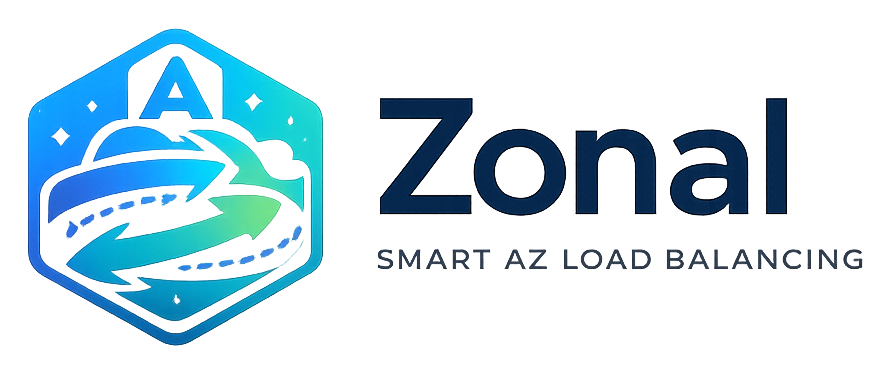

<p align="center">
  
</p>

# AZ-affine load balancing, client-side

**`zonal` keeps your service-to-service (east-west) traffic in the same Availability Zone** — cutting
the cross-AZ data-transfer bill without putting an ALB/NLB in the path. Each caller picks a healthy
host *in its own AZ*, falling back to other AZs only when it must.

> One job: `balancer.pick()` hands you a healthy same-AZ host. **You own the transport** — your HTTP
> client, your auth, your retries.

## The problem

EC2 callers hit other EC2 hosts directly. With no load balancer enforcing locality, a caller in
`az-A` happily talks to a host in `az-B` — and every gigabyte that crosses the AZ boundary is billed
(~`$0.01/GB` *each way*). At hundreds of TB/month of east-west traffic, that is **thousands of
dollars** of pure transfer cost.

The usual fix — an internal NLB with cross-zone disabled — keeps traffic in-AZ but re-introduces a
per-GB processing fee that, at that volume, costs nearly as much as the problem it solves. `zonal`
keeps the traffic peer-to-peer and intra-AZ, which is free.

## How it works

```
  caller (in az-A)                                         target hosts
 ┌─────────────────────────────────────┐
 │ zonal.Balancer                      │
 │                                     │        ┌─────────────┐
 │ RefreshLoop ~5s ─ DiscoverInstances │  pick()  │ host (az-A) │   preferred · intra-AZ · free
 │   (AZID = az-A)                     │ ───────▶ └─────────────┘
 │                                     │          ┌─────────────┐
 │ HostCache · round-robin · breaker   │ fallback │ host (az-B) │   only if no healthy az-A host
 └─────────────────────────────────────┘ ╌╌╌╌╌╌▶ └─────────────┘   (cross-AZ · billed)
        ▲ HEALTHY hosts          ▲ report_failure / report_success (your transport)
        │                        │
 ┌──────────────────────────────┐      ┌──────────────────────────────┐
 │ AWS Cloud Map (registry)     │◀──── │ zonal-healthcheck (daemon)   │
 │ HEALTHY / UNHEALTHY status   │ push │ probes /health · hysteresis  │
 └──────────────────────────────┘      └──────────────────────────────┘
```

## Features

- 🎯 **A healthy host in your AZ** — `pick()` returns a same-AZ host, falling back to other AZs only
  when none are healthy. zonal selects; you own the transport.
- 🧭 **AZ affinity is client-side authoritative** — affinity is re-applied locally, so it behaves
  identically on real AWS and on emulators that ignore `DiscoverInstances` `OptionalParameters`.
- 🆔 **AZ-ID, not AZ-name** — AZ names are randomized per account; the AZ-ID (`euw1-az1`) is stable.
- 🩺 **Two-layer health** — Cloud Map holds shared slow-moving status; the balancer adds a fast local
  circuit breaker you feed with `report_failure` / `report_success`.
- ⚡ **Cache-only hot path** — a background loop refreshes hosts; `pick()` never calls AWS inline.
- 🔄 **Sync & async** — `Balancer` and `AsyncBalancer` over a shared core.
- 🪵 **Structured JSON logs** — `structlog`, opt-in, never hijacks the host app's logging.

## Start here

- 🚀 **[Getting started](guide/getting-started.md)** — install and make your first AZ-local call.
- 📞 **[Calling a service](guide/calling.md)** — sync and async callers, the circuit breaker.
- 📍 **[Registering a host](guide/registering.md)** — self-register at boot.
- 🩺 **[Health service](guide/health-service.md)** — the out-of-band probe daemon.
